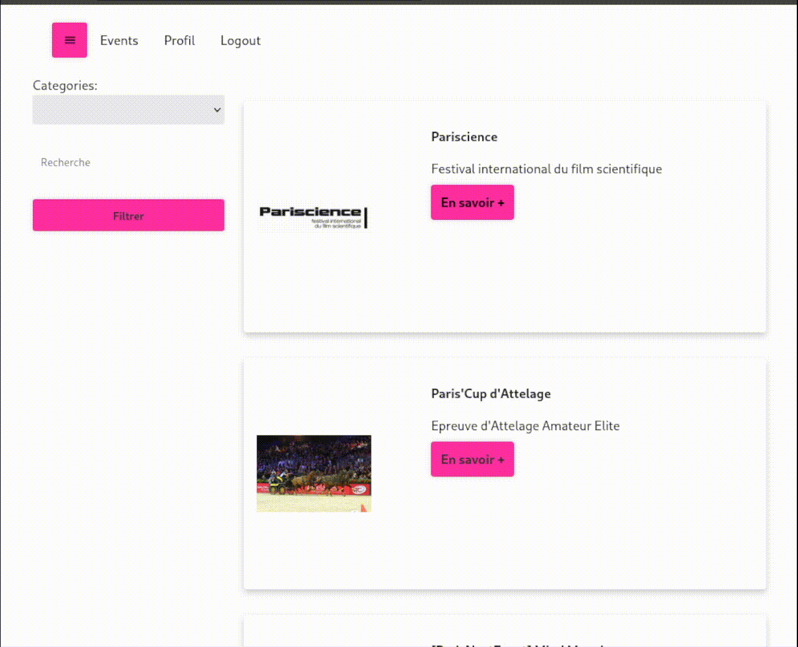

# My Events

## Listing d'événements et de sorties culturelles (concert, expo...)

## Introduction

\*_Projet d'école réalisé au sein de la W@C_

```
23/10/2022 : 

Les routes de l'API ont changé !
```
Utilisation de l'API d'Opendatasoft.

- MongoDB
- Express.js
- React
- Node.js

## Usage

```bash
npm install &&

npm start;

firefox http://localhost:3000/
```

## Cahier des charges

### Gestion des utilisateurs

- Un système de connexion : l’utilisateur peut se connecter en fournissant un nom d’utilisateur.
- Un système d'inscription : l’utilisateur peut s'inscrire

### Filtres

- Possibilité de filter les événements et de faire une recherche par mots-clés / texte


